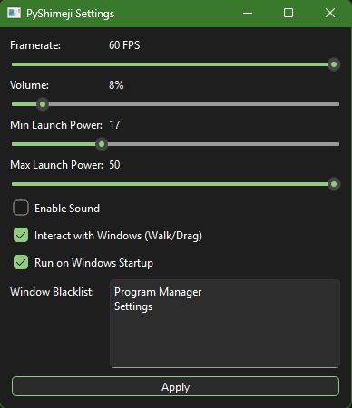

# PyShimeji

PyShimeji is a Python port of the original Shimeji project. It allows you to have small animated characters called mascots or shimejis wandering around your screen while you work.

## Overview

This application brings the fun of desktop mascots to Python. While it was initially designed with Chiikawa and friends in mind, the program is versatile and can load any Shimeji character pack.

## Features

*   **Multi Monitor Support**: Characters can freely walk and fly between all your connected monitors.
*   **Window Interaction**: Mascots can walk on top of your open windows and climb their sides.
*   **Customizable Physics**: Adjust the launch power in the settings to control how mascots behave when they get stuck or are thrown.
*   **Fullscreen Awareness**: Mascots will automatically ignore fullscreen apps and games to stay out of your way.
*   **Reset Option**: Quickly redistribute all characters across your screens via the system tray menu.

## Installation Instructions

1.  **Download Python**: Ensure you have Python installed on your computer.
2.  **Download PyShimeji**: Download this repository as a ZIP file and extract it to a folder on your computer.
3.  **Install Requirements**: Open a command prompt in the project folder and run:
    `pip install -r requirements.txt`
4.  **Run the Program**: Double click `run_silent.bat` or run `python main.py` in your terminal.

## Usage Instructions

### Adding New Characters

1.  Find a Shimeji character ZIP file online.
2.  Place the ZIP file in the main folder (the same folder where the .zip files for Chiikawa or Usagi are located).
3.  Restart the program. The new character will be loaded automatically.
4.  The program can handle as many characters as you want. There is no limit on the amount of mascots you can run at once.

### Accessing Settings

1.  Find the computer icon in your system tray (near the clock on your taskbar).
2.  Right click the icon to open the menu.
3.  Choose **Settings** to adjust the framerate, volume, or launch power.

### Resetting Positions

If characters get lost or you want them in new spots:
1.  Right click the tray icon.
2.  Choose **Reset Positions**.

## Demonstration

## Goal of the Project

The goal of this project is to provide a modern and lightweight Python implementation of desktop mascots while maintaining compatibility with the vast library of existing Shimeji character packs.

## Support the Project

If you enjoy using PyShimeji and would like to support my work, you can buy me a coffee.

